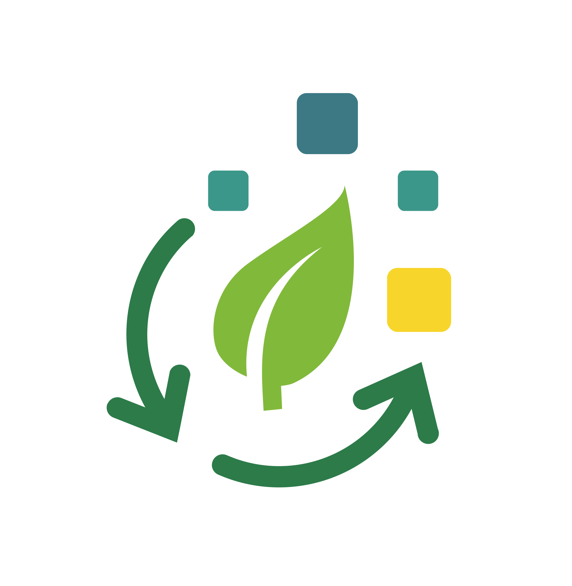

<h1 align="center">WasteTrack</h1>

<p align='center'>
  <a href="https://app.wastetrack-its.com" target="_blank"></a>
  <a href="https://reactjs.org/" target="_blank"></a>
  <a href="https://firebase.google.com/" target="_blank"></a>
  <a href="https://threejs.org/" target="_blank"></a>
  <a href="https://leafletjs.com/" target="_blank"></a>
  <a href="https://gemini.google.com/" target="_blank"></a>
</p>
<p align="center"></p>

<h3 align="center">Timses AITIES</h3>

<h5 align="center">Institut Teknologi Sepuluh Nopember</h5>

<div align="center">

| Nama Anggota                       | NIM        | Program Studi      |
| ---------------------------------- | ---------- | ------------------ |
| Hilmi Fawwaz Sa'ad                 | 5025221103 | Teknik Informatika |
| Dian Kusumawati                    | 5025221106 | Teknik Informatika |
| Muhammad Rayyaan Fatikhahur Rakhim | 5025221047 | Teknik Informatika |

</div>

---

## 🚀 Cara Menjalankan Aplikasi WasteTrack

#### Prasyarat

Sebelum memulai, pastikan Anda telah menginstal:

- Node.js (versi 22.0.0 atau lebih tinggi)
- npm (biasanya terinstal bersama Node.js)
- Git

#### Getting Started

Ikuti langkah-langkah berikut untuk menjalankan proyek ini secara lokal:

### 1. Clone Repository

```bash
git clone https://github.com/GIG-Community/wastetrack-frontend.git
cd wastetrack-frontend
```

### 2. Install Dependensi

```bash
npm install
```

### 3. Konfigurasi .env

- Copy file .env.example dan ubah menjadi .env
- Tambahkan konfigurasi pada .env seperti di bawah oini :

```bash
VITE_FIREBASE_API_KEY=your_api_key
VITE_FIREBASE_AUTH_DOMAIN=your_api_key
VITE_FIREBASE_PROJECT_ID=your_api_key
VITE_FIREBASE_STORAGE_BUCKET=your_api_key
VITE_FIREBASE_MESSAGING_SENDER_ID=your_api_key
VITE_FIREBASE_APP_ID=your_api_key
VITE_FIREBASE_MEASUREMENT_ID=your_api_key

VITE_GEMINI_API_KEY=your_api_key
GEMINI_API_KEY=your_api_key
```

### 4. Jalankan Server Pengembangan

```bash
npm start
```

- Aplikasi akan berjalan pada mode pengembangan dan dapat diakses di http://localhost:5173/ pada browser Anda.

## ❓ FAQ

Beberapa pertanyaan dan issues dalam menjalankan aplikasi:

</p>
<details style="margin-bottom: 12px;">
<summary><strong>Bagaimana cara mengakses aplikasi yang sudah di-deploy?</strong></summary>
<p>Aplikasi WasteTrack yang sudah di-deploy dapat diakses melalui <a href="https://app.wastetrack-its.com" target="_blank">https://app.wastetrack-its.com</a></p>
</details>
<details style="margin-bottom: 12px;">
<summary><strong>Apakah saya perlu akun untuk menggunakan WasteTrack?</strong></summary>
<p>Ya, Anda memerlukan akun untuk mengakses sebagian besar fitur WasteTrack. Proses pendaftaran dapat dilakukan langsung melalui aplikasi menggunakan email atau akun Google Anda.</p>
</details>
<details style="margin-bottom: 16px;">
  <summary><strong>Kenapa UI di beberapa role ada yang masih berantakan?</strong></summary>
  <p>
    Tampilan antarmuka untuk beberapa role selain <em>user</em> saat ini masih dalam tahap pengembangan dan penyesuaian. Fokus utama pengembangan awal adalah pada role <strong>user</strong>, sehingga role lain seperti <strong>admin</strong>, <strong>petugas</strong>, atau <strong>pengelola</strong> mungkin belum sepenuhnya dioptimalkan. 
    <br><br>
    Kami merekomendasikan penggunaan perangkat desktop untuk role-role tersebut agar fungsionalitas tetap dapat diakses dengan baik.
    <br><br>
    UI untuk seluruh role masih terus kami kembangkan dan perbaiki agar ke depannya dapat memberikan pengalaman pengguna yang lebih baik dan konsisten.
  </p>
</details>

<details style="margin-bottom: 12px;">
<summary><strong>Apakah aplikasi dapat digunakan di perangkat mobile?</strong></summary>
<p>WasteTrack dirancang dengan pendekatan responsive design khusus untuk pengguna dengan role user, sehingga dapat diakses dengan nyaman melalui browser di perangkat mobile maupun desktop. Untuk role lainnya (seperti admin, petugas, atau pengelola), disarankan untuk menggunakan perangkat desktop guna pengalaman yang lebih optimal. Kami juga sedang mengembangkan aplikasi native untuk Android dan iOS yang akan dirilis dalam waktu dekat.</p>
</details>
<details style="margin-bottom: 12px;">
<summary><strong>Bagaimana cara melihat statistik pengelolaan sampah?</strong></summary>
<p>Statistik pengelolaan sampah dapat diakses melalui dashboard aplikasi. Fitur ini menampilkan data analitik seperti volume sampah, kategori sampah, tren waktu, dan perbandingan antar departemen/fakultas. Fitur ini hanya tersedia untuk pengguna dengan akses admin atau pengguna yang memiliki izin khusus.</p>
</details>
<details style="margin-bottom: 12px;">
<summary><strong>Apakah ada API publik yang dapat diakses?</strong></summary>
<p>Saat ini, API WasteTrack hanya tersedia untuk penggunaan internal dan mitra resmi. Jika Anda tertarik untuk mengintegrasikan sistem Anda dengan WasteTrack, silakan hubungi tim pengembang untuk diskusi lebih lanjut mengenai kemungkinan kolaborasi.</p>
</details>
<details style="margin-bottom: 12px;">
<summary><strong>Bagaimana cara mengatasi masalah koneksi ke Firebase?</strong></summary>
<p>Jika Anda mengalami masalah koneksi ke Firebase:

Pastikan kredensial Firebase Anda benar di file .env
Verifikasi bahwa layanan Firebase aktif di dashboard Firebase
Periksa apakah aturan keamanan Firebase telah dikonfigurasi dengan benar
Pastikan Anda memiliki koneksi internet yang stabil
Jika masalah masih berlanjut, coba hapus cache browser atau gunakan mode incognito

</p>
</details>
<details style="margin-bottom: 12px;">
<summary><strong>Bagaimana cara berkontribusi pada pengembangan WasteTrack?</strong></summary>
<p>Kami menyambut kontribusi dari komunitas! Untuk berkontribusi:

Fork repositori GitHub kami
Buat branch untuk fitur atau perbaikan Anda
Implementasikan perubahan Anda dengan mengikuti panduan gaya kode
Kirim pull request dengan deskripsi yang jelas tentang perubahan Anda
Tim kami akan meninjau dan mendiskusikan perubahan sebelum diintegrasikan

</p>
</details>
<details style="margin-bottom: 12px;">
<summary><strong>Siapa yang dapat saya hubungi untuk dukungan teknis?</strong></summary>
<p>Untuk dukungan teknis, Anda dapat:

- Mengirim email ke info@wastetrack-its.com
- Membuka issue di repositori GitHub kami
- Menghubungi salah satu anggota tim pengembang:
    - Hilmi Fawwaz Sa'ad: 5025221103@student.its.ac.id
    - Dian Kusumawati: 5025221106@student.its.ac.id
    - Muhammad Rayyaan Fatikhahur Rakhim: 5025221047@student.its.ac.id

</p>
</details>
